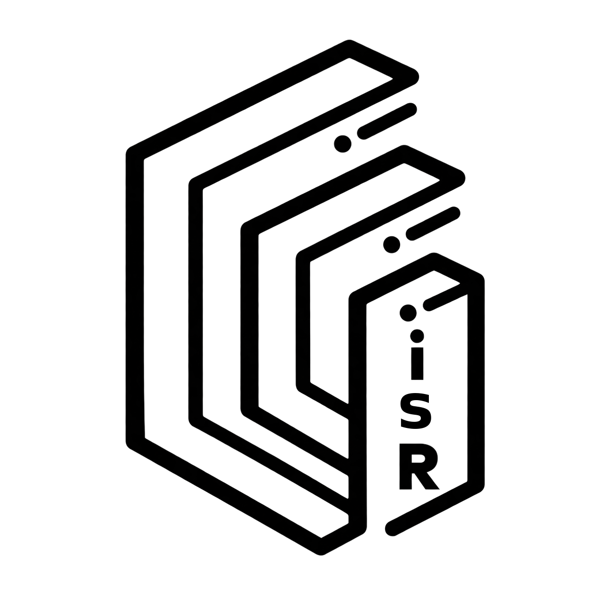

<p align="center">
  
</p>

# TensorCube

**GPU Tensor Iteration Solver**  
**Matrix-Free exact discrete tensor computation**

TensorCube is an archival research artifact for studying how a representation change can move an extreme-scale discrete state problem away from explicit global materialization and toward a GPU-oriented Matrix-Free computation model.

The cube is used as a compact, visual stress test. The research object is the representation and execution structure: stable identity, logical site, discrete orientation, orbit/component factorization, on-demand state reconstruction, exact verification, and direct Matrix-Free rendering.

> **Archival status**  
> TensorCube is intentionally preserved without an ongoing maintenance commitment. Its validated implementation was produced through a long-running AI programming-agent workflow whose effective development context reached its practical limit. Continuing implementation from a newly initialized conversation would no longer preserve the same accumulated context and could introduce architectural, behavioral, or terminology drift. The released executable already contains the intended demonstrator and verification path, so preservation of the validated artifact is preferred over reopening development under a reset context.

## Core state

Each surface element is represented by three authoritative quantities:

- `i` — stable identity
- `s` — logical site
- `R` — discrete orientation

The high-order path does not require the complete surface state to exist as one explicit global array. Component state is reconstructed when needed from a compact descriptor and the corresponding logical component.

## Supported orders

The executable exposes:

- every order from `2` through `49`
- `100`
- `1000`
- `10000`
- `100000`

For a cube of order `N`, the number of surface sites is

```text
S(N) = 6N² - 12N + 8
```

For even `N`, the component count used by the Matrix-Free decomposition is

```text
C(N) = N²/4 - N/2 + 1
```

At `N = 100000`, this corresponds to `59,998,800,008` surface sites and `2,499,950,001` orbit components without explicitly materializing the full surface tensor.

## Solver structure

The solver follows one exact discrete factorization path rather than retaining a scramble history or relying on a conventional cube-specific lookup solver.

```text
compact random descriptor
        ↓
logical component
        ↓
on-demand Matrix-Free component state
        ↓
exact quotient/component factorization
        ↓
GPU/CPU work execution
        ↓
exact replay / identity verification
        ↓
verified solution
```

The GPU execution path includes a runtime-loaded NVIDIA CUDA Driver path with an INT8 WMMA Tensor Core reduction lane where the runtime self-test accepts it. The application does not statically import `nvcuda.dll`.

## Matrix-Free high-order rendering

For orders above 10, rendering does not build six persistent face-state textures or a CPU face-pixel cache. A visible fragment is mapped directly through the logical state:

```text
fragment
  → logical site
  → orbit component
  → descriptor-derived component state
  → quotient reversal
  → inverse stabilizer transversal
  → source marker
  → color
```

Screen resolution changes fragment count only. It does not define a lower-order proxy puzzle.

## Exactness boundary

A displayed successful solve is accepted only after exact discrete state verification. TensorCube is not presented as a shortest-path solver. Its benchmark target is exact completion under the same representation path across widely separated orders.

## Windows executable

The fixed Windows artifact is:

```text
dist/TensorCube.exe
```

SHA-256:

```text
720dcbcd0c9c3b03006bd668ab1dd3988847cb1dbed1eaf866ee5990d1ea0545
```

The executable is a portable x86-64 Windows GUI program. The final OpenGL shader compilation and vendor-specific GPU execution occur on the user's runtime environment.

## Documentation

- [`docs/ARCHITECTURE.md`](docs/ARCHITECTURE.md) — representation and execution model
- [`docs/REPRODUCIBILITY.md`](docs/REPRODUCIBILITY.md) — artifact verification and benchmark protocol
- [`MANIFEST.sha256`](MANIFEST.sha256) — fixed binary asset hashes

## Authorship and implementation disclosure

Research direction, problem formulation, mathematical representation, architecture decisions, experimental design, failure analysis, and acceptance criteria were supplied by the human investigator.

The executable implementation and its source code were generated with AI assistance; no source code was manually authored by the human investigator.

## Citation

Citation metadata is provided in [`CITATION.cff`](CITATION.cff).

## License

TensorCube is distributed under the **MatrixFreeSama Permissive License 2.0 (MFSPL 2.0)**. See [`LICENSE`](LICENSE).

The license grants automatic commercial and non-commercial permission without a separate request, registration, reporting, or approval channel. It imposes no additional field-of-use restriction beyond compliance with the law applicable to the user's actual conduct, and it includes user-responsibility and indemnification provisions protecting MatrixFreeSama to the maximum extent permitted by applicable law.

For SPDX-oriented metadata, the local custom reference is:

```text
LicenseRef-MatrixFreeSama-Permissive-2.0
```

---

### 中文简介

TensorCube 是一个用于展示 **Matrix-Free 表示重构** 的存档研究制品。它以高阶 `N×N×N` 转动拼图作为可视化压力测试载体，但研究重点不是提出新的人工魔方公式，而是验证：当完整逻辑状态不再被要求显式物化时，极端规模的离散计算能否被压缩到消费级 GPU 可承载的表示与执行结构中。

本项目有意不设持续维护路线。经过验证的实现来自一个长期 AI 编程代理工作流，其有效开发上下文已达到实际容量边界；若在新建对话中重新继续开发，累积上下文无法原样延续，存在架构、行为和术语漂移的风险。当前发布的 EXE 已包含本研究制品预定的演示与验证能力，因此选择封存已验证制品，而不是在重置上下文后继续演化。
